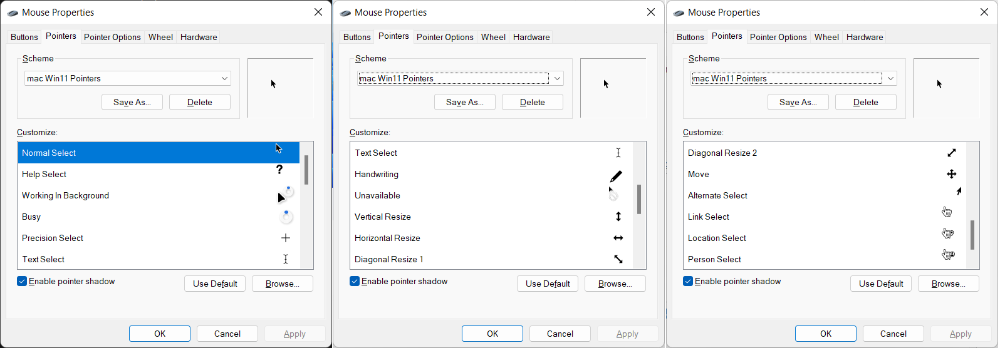

# mac-Win11-Pointers

Hello, I'm Nam and I am the fan of macOS cursors and I use Windows 11 for my daily tasks, so this is my custom cursors from native macOS cursors and the `Windows 11 Cursors Concept by jepriCreations` for my personal using. If you like this, folk and use it. ;)

## How to use

1. Right click Install.inf and click «Install»
2. Cursors install automatically and will open menu Mouse Properties. You have to press "OK" button to Apply the new cursors.

Alternative:
1. Go to Control Panel → Mouse and choose «mac Win11 Pointers» scheme.
2. Apply and enjoy the best cursors ever!

## Acknowledgements

1. [Pointers in macOS](https://support.apple.com/en-vn/guide/mac-help/mh35695/mac)
2. [DevianArt jepriCreations](https://www.deviantart.com/rosea92)
3. [Apple User Agreement](https://images.apple.com/legal/sla/docs/OSX1011.pdf)